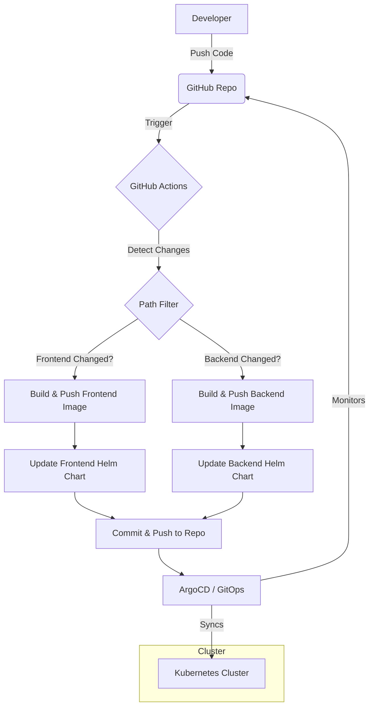

# 🚀 GitOps End-to-End Project

> A complete microservices-based application demonstrating modern GitOps practices using Kubernetes, Helm, GitHub Actions, and Docker.


## 📖 Overview

This repository hosts a full-stack application composed of a **React frontend** and a **Flask backend**, orchestrated via **Kubernetes** and managed through a **GitOps** workflow. Changes to the source code automatically trigger CI/CD pipelines that build Docker images, update Helm charts, and maintain the desired state of the application in the cluster.

---

## 🏗 Architecture & GitOps Flow

The project follows a rigorous GitOps workflow where the git repository is the single source of truth.



### 🔄 CI/CD Pipeline

The `cicd.yml` workflow acts as the automation engine:

1.  **Change Detection**: Checks if changes occurred in `frontend/` or `backend/`.
2.  **Containerization**: Builds optimized Docker images for the modified services.
3.  **Registry Push**: Pushes the new images to Docker Hub (`gitopsfront` / `gitopsback`).
4.  **Manifest Update**: Automatically updates the `image.tag` in the respective Helm `values.yaml` files.
5.  **Git Write-Back**: Commits the configuration changes back to the repository, ready for the GitOps operator (e.g., ArgoCD) to pick up.

---

## 🛠 Tech Stack

### Frontend

- **Framework**: React (via Vite)
- **Server**: Nginx (Alpine-based)
- **Environment**: Dynamic environment variable injection at runtime via `env.sh`.

### Backend

- **Framework**: Python Flask
- **Base Image**: Distroless (for security and minimal footprint)
- **API**: RESTful JSON responses.

### DevOps

- **Containerization**: Docker (Multi-stage builds)
- **Orchestration**: Kubernetes & Helm
- **CI/CD**: GitHub Actions
- **Registry**: Docker Hub

---

## 📂 Project Structure

```bash
gitops-end-to-end-project/
├── .github/workflows/
│   └── cicd.yml           # CI/CD Pipeline definition
├── backend/               # Python Flask Service
│   ├── app.py             # Application entry point
│   ├── Dockerfile         # Multi-stage distroless build
│   └── requirements.txt   # Python dependencies
├── frontend/              # React Vite Service
│   ├── src/               # Source code
│   ├── Dockerfile         # Multi-stage Nginx build
│   ├── nginx.conf         # Custom Nginx configuration
│   └── env.sh             # Runtime config injector
├── helm/                  # Kubernetes Manifests (Helm)
│   ├── backend/           # Backend Chart
│   └── frontend/          # Frontend Chart
└── README.md              # Project Documentation
```

---

## 🚀 Getting Started

### Prerequisites

- Docker
- Kubernetes Cluster (Minikube / Docker Desktop / Cloud Provider)
- Node.js & Python (for local dev)

### 1. Local Development

**Frontend:**

```bash
cd frontend
npm install
npm run dev
```

**Backend:**

```bash
cd backend
python3 -m venv venv
source venv/bin/activate
pip install -r requirements.txt
python app.py
```

### 2. Docker Build & Run

Test the containers locally before pushing.

```bash
# Backend
docker build -t gitops-backend ./backend
docker run -p 5000:5000 gitops-backend

# Frontend
docker build -t gitops-frontend ./frontend
docker run -p 80:80 gitops-frontend
```

### 3. Deployment (Helm)

Deploy the application to your Kubernetes cluster using Helm.

```bash
# Deploy Backend
helm upgrade --install backend ./helm/backend

# Deploy Frontend
helm upgrade --install frontend ./helm/frontend
```

---

## 🌐 Kubernetes Configuration details

### **Helm Charts**

The `helm/` directory contains the source of truth for the infrastructure.

- **Values.yaml**: Controlled by the CI pipeline. The `image.tag` is automatically updated on every successful build.
- **Deployment**: Defines replicas, readiness probes, and resources.
- **Service**: Exposes the application within the cluster.

### **Network config (Nginx)**

The frontend utilizes a custom `nginx.conf` and `env.sh` script to ensure that:

1.  React router handles navigation correctly (`try_files $uri /index.html`).
2.  Environment variables are loaded at runtime, allowing the same Docker image to move across environments (Dev/Staging/Prod) without rebuilding.

---

## 🛡 Security Highlights

- **Distroless Backend**: The Python backend uses a Google Distroless image, removing shells and unnecessary binaries to reduce the attack surface.
- **Alpine Nginx**: The frontend uses a lightweight Alpine image.
- **Non-Root Users**: Best practices applied where possible.

---
